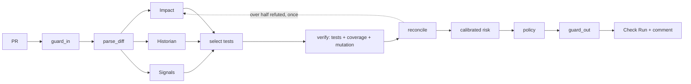

# SentinelPR

**Self-verifying, evidence-gated release intelligence for pull requests.**

AI code reviewers make claims — "this only affects billing", "this is well tested" — that nobody
checks. SentinelPR treats every such statement as a hypothesis. Agents make structured claims
about a pull request, **execution verifies them** (running the relevant tests and mutating the
changed lines), a **calibrated model** turns the verified evidence into a defect probability, and
the gate decides: **PASS**, **CANARY** or **BLOCK**. After merge, a canary rollout with automatic
rollback watches the change in (simulated) production.

> LLMs propose. Execution verifies. A calibrated model decides. The pipeline acts. A human approves.

Everything runs on GitHub Actions and free tooling. No LLM is required: without providers the
agents fall back to evidence-only claims, and the decision never depends on model output anyway.

## What a PR sees

A real run (`python demo/scenarios.py hidden`): a one-word "cleanup" in UniERP's registration
guard that **every existing test passes**:

```
## 🛡️ SentinelPR — ⛔ BLOCK (risk 0.89, calibrated)
Tests: 10/107 selected (90% of suite time saved) — all pass · changed lines executed: 100% · mutation score on changed lines: 25% ⚠️
History: register was involved in bug fix 5d57477 (issue #60: Course section accepts one student over capacity)
Why this score: share of changed lines executed by tests (-1.40), mutants on changed lines that no test notices (+1.35), past bug fixes in the touched functions (+0.55)
Decision: merge blocked until the issues below are addressed — risk 0.89 >= block threshold 0.87
```

plus a **SentinelPR Gate** Check Run (success / neutral / failure — make it a required check) and
annotations on the diff: *changed line not executed by any test*, *mutant survived here*,
*function linked to a past bug*.

## How it works



| Stage | What happens |
|---|---|
| **Guard-in** | Size limits, secret detection (nothing leaves the runner if a secret is found), prompt-injection scanning of the title, body, commits and code comments; flagged spans are neutralised before any model sees them |
| **Diff → change units** | tree-sitter maps changed lines to the functions, methods and classes they belong to (renames detected) |
| **Impact agent** | Tests and modules the change affects and API breaks, from line-level coverage, call paths in the code graph and hybrid retrieval. With an LLM, the model chooses claims *only from that evidence* |
| **Historian agent** | Links changed functions to past bug fixes (SZZ) and to the issues/PRs that explain the current behaviour |
| **Signals agent** | Classic just-in-time metrics: size, diffusion, ownership, churn, complexity delta, defect history |
| **Verifier** | Runs the selected tests on the head with per-test coverage, then mutates only the changed lines in a scratch copy and runs the covering tests against each mutant. Every claim becomes VERIFIED, REFUTED or UNVERIFIABLE |
| **Risk model** | Logistic model over ~30 features; the model family (expert weights with learned calibration, or fitted sign-constrained weights) is chosen by forward-chained validation; stored as JSON |
| **Policy** | BLOCK on verified test failures or high risk; CANARY in between; thresholds keep false blocks ≤ 5% |
| **Canary** | Stable vs canary behind a weighted proxy; each step judged on its own traffic; first SLO breach rolls back |

Details: [docs/architecture.md](docs/architecture.md).

## Results

Benchmark on **UniERP** (the bundled demo service): 154 generated pull requests across 4
releases, each labelled **by execution** — a PR is defective when a test that passes on its base
(the base's own suite or a hidden oracle suite SentinelPR never sees) fails on the PR. Risk-gate
numbers are **forward-chained** out-of-fold predictions: a PR on release *k* is scored by a model
trained on earlier releases and calibrated on release *k−1*.

**RQ3 — release gate** (75 PRs; 95% bootstrap CIs in [bench/results/uni-erp/report.md](bench/results/uni-erp/report.md))

| method | PR-AUC | ROC-AUC | recall @ 5% FPR | ECE | false blocks | defective PRs blocked |
|---|---|---|---|---|---|---|
| **SentinelPR** | **0.982** | **0.966** | **0.851** | 0.088 | **0%** | **79%** |
| SentinelPR, fitted weights | 0.954 | 0.933 | 0.745 | 0.060 | 3.6% | 81% |
| merge if tests pass | 0.897 | 0.862 | 0.723 | 0.173 | 0% | 72% |
| JIT defect prediction | 0.871 | 0.799 | 0.383 | 0.074 | 0% | 15% |
| ablation: no verification evidence | 0.857 | 0.771 | 0.298 | 0.263 | 0% | 77% |

Removing the verified evidence is what hurts: PR-AUC falls from 0.98 to 0.86. On this benchmark
mutation adds little on top of changed-line coverage (0.981 without it); history features barely
move the numbers. All benign refactors and test/docs-only PRs passed. Of the 7 hidden-fault PRs
scored out of fold (every visible test passes, the change is still defective), 6 were held back
(2 BLOCK, 4 CANARY) and 1 passed.

With only ~115 training PRs, expert weights with a learned calibration beat fitted coefficients
out of fold, so that family is deployed; the selection procedure and both results are in the
report.

**RQ1 — change impact**: test-impact F1 0.71 (static reachability 0.59, name search 0.44; Wilcoxon
p < 0.001). Test selection runs 11 of 107 tests on average — 86% of suite time saved — while
still selecting 95% of the tests that actually fail.

**RQ5 — cost**: 4.1 s per PR at the median (13.4 s p95) on a laptop, almost all of it test
execution and mutation; zero LLM tokens in the committed runs.

**RQ2 — claim verification**: of 789 execution-checkable impact claims, 54% were true before
verification and 100% of those kept as VERIFIED were true, at the cost of 8% of true claims
becoming unverifiable or refuted. (Verification and ground truth both rest on execution, so the
second number is partly by construction; the recall cost is the informative part.)

**RQ4 — repository Q&A** (41 questions, extractive mode): accuracy 98% with code + history
retrieval vs 49% with code only; 0% hallucinated answers on unanswerable and adversarial
questions.

**RQ6 — adversarial robustness**: 0 of 24 attacked defective PRs (injection in title, body or
comments; planted secrets; oversized diffs) received PASS; no guardrail false positives on
benign PRs.

Limitations and threats to validity: [docs/evaluation.md](docs/evaluation.md).

## Quick start

```bash
python -m venv .venv && source .venv/bin/activate
pip install -r sentinel/requirements.txt
python -m sentinel.data.index --seed-demo              # build UniERP's history + the index
python demo/scenarios.py                               # analyse the demo PRs
python -m sentinel.run --base main                     # analyse your working tree
```

Dashboard: `python -m sentinel.publish.dashboard_data && cd dashboard && npm install && npm run dev`.
Full setup, LLM providers, Zoekt/Sourcegraph and the canary: [docs/setup.md](docs/setup.md).

## Use it in your repository

```yaml
- uses: actions/checkout@v4
  with: { fetch-depth: 0 }
- uses: gmayank9999/SentinelPR@v1
  with:
    groq_api_key: ${{ secrets.GROQ_API_KEY }}      # optional
    gemini_api_key: ${{ secrets.GEMINI_API_KEY }}  # optional
    project-requirements: requirements.txt
```

## Commands

Comment on a PR or issue (owners, members and collaborators only):

| command | effect |
|---|---|
| `/sentinel ask <question>` | answer from the code and its history, citing sources — or refuse |
| `/sentinel explain` | the evidence and trace behind the latest decision |
| `/sentinel rerun` | analyse again and republish |
| `/sentinel fix` | the Patch Advisor proposes a tested, safety-reviewed fix as a draft PR |

## Repository layout

```
sentinel/            the tool
  data/              history mining, tracker data, SZZ, per-test coverage map, SQLite store
  retrieval/         tree-sitter chunker, diff parser, code graph, BM25, embeddings, code search, fusion
  agents/            impact, historian, signals, test selection, Q&A, patch advisor, prompts/
  llm/               providers (Groq, Gemini, Ollama), cache, client
  orchestrator/      LangGraph pipeline, state, model router
  verify/            test runner, mutation engine, claim checkers, reconciler
  risk/              features, calibrated model, policy, explanations, trainer
  guards/            input and output guardrails
  canary/            proxy, traffic, SLO monitor, rollout controller
  publish/           PR comment, Check Run, dashboard data
bench/               PR generators (C1–C7), execution oracle, runner, statistics, Q&A set, hidden tests
demo/uni-erp/        the demo service, its tests, and the scripted development history
dashboard/           React dashboard (GitHub Pages)
docs/                architecture, setup, evaluation, responsible use
.github/workflows/   PR gate, index, commands, canary, benchmark, CI, dashboard
action.yml           reusable action
```

## License

MIT © Mayank Gupta
