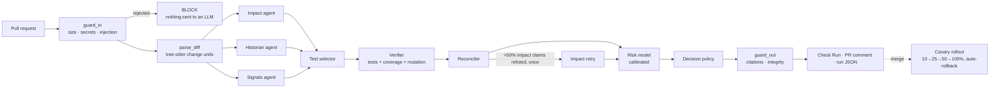

# Architecture

SentinelPR turns a pull request into a release decision in five stages:
**claims → verification → calibrated risk → decision → rollout**.



The graph is a LangGraph `StateGraph` (`sentinel/orchestrator/pipeline.py`). Impact, Historian
and Signals run in parallel; every node is timed and its token usage recorded in the run's
`trace`, which the dashboard replays.

## Services

| Service | Package | Responsibility |
|---|---|---|
| Data | `sentinel/data` | Commit mining down to functions, issue/PR tracker data, SZZ, per-test coverage map, SQLite store |
| Retrieval | `sentinel/retrieval` | tree-sitter chunking, diff → change units, code knowledge graph, BM25, dense embeddings, Zoekt/Sourcegraph/local search, RRF fusion, reranking |
| Agents | `sentinel/agents`, `sentinel/llm`, `sentinel/orchestrator` | Impact, Historian, Signals, test selection, Q&A, Patch Advisor; LLM client with routing, fallback and caching |
| Verification & release | `sentinel/verify`, `sentinel/risk`, `sentinel/canary` | Test execution, targeted mutation, claim checkers, risk model, policy, canary controller |
| Evaluation & dashboard | `bench`, `dashboard`, `sentinel/api.py` | PR generators, execution oracle, statistics, React dashboard, API |

Each service is an importable package. Inside GitHub Actions everything runs in-process;
locally `python -m sentinel.api` exposes runs, Q&A and the graph over HTTP.

## Change units

`sentinel/retrieval/diff_parser.py` parses `git diff --unified=0` and maps changed lines onto
the innermost function, method or class of the old and new file (tree-sitter, with an `ast`
fallback). A symbol whose body moved to a new name is recognised as a rename. Lines outside
every symbol form a `<module>` unit; blank lines are ignored.

## Code knowledge graph

Nodes are files, symbols (functions, methods, classes, tests), commits, issues and pull
requests. Edges: `contains`, `imports`, `calls`, `inherits`, `tests` (from the coverage map),
`modified_in`, `fixes`, `introduced_bug` (SZZ) and `discussed_in`.

Call targets are resolved through imports first, then same-file and same-class definitions,
and only then by name, with at most three candidates (each at reduced confidence). Structural
edges always come from the code under review; coverage and history edges come from the index
of the base revision and are carried over by qualified name, because a PR shifts line
numbers but rarely renames what it touches.

## Claims and verification

Agents never talk to the rest of the system in prose. Every output is a `Claim`
(`sentinel/models.py`) with a type, a target and at least one evidence id:

| claim | example target | verified when |
|---|---|---|
| `test_impact` | `tests/test_grades.py::test_gpa_rounds_half_up` | the test executes a changed line on the head, fails there, or kills a mutant of a changed line |
| `module_impact` | `unierp/fees/calculator.py` | a call path reaches the change **and** a test executing changed lines also executes the module |
| `api_break` | `unierp/registration/credits.py::calculateStudentCredits` | the signature became incompatible and callers exist, or callers' tests fail |
| `history_link` | a changed symbol | the cited commit exists and touches it; cited issues/PRs exist |
| `rationale` | a changed symbol | the cited issue/PR text supports the statement (LLM judge, or lexical entailment) |

In LLM mode the Impact agent sees only evidence gathered deterministically (line-level
coverage of the lines the PR modifies, call paths, retrieved code). A claim citing an id it
was not given is discarded before verification.

The verifier runs the selected tests once, on the head, with per-test coverage contexts.
Targeted mutation then mutates only executable changed lines (comparison, arithmetic,
boolean, negation, constant, return and condition operators — round-robin across lines,
capped per PR) in a scratch copy, and runs just the tests that cover each mutated line.
Lines that only execute at import time (constants) are counted as executed and their
mutants run against the PR's selected tests.

## Risk and decision

`sentinel/risk/features.py` defines ~30 features in four groups: classic JIT change metrics,
verified evidence (failures, changed-line coverage, mutation score, surviving mutants,
verified impact, verified bug links, refuted-claim ratio), the Impact agent's LLM rating and
guardrail observations. A standardised logistic regression (LightGBM optional) is trained on
benchmark PRs, calibrated with isotonic or Platt scaling on a later revision, and stored as
plain JSON. Until a model is trained, a hand-weighted prior is used.

```
if verified test failures > 0 or risk ≥ block:  BLOCK
elif risk ≥ canary:                              CANARY
else:                                            PASS
```

Thresholds are chosen on validation data so that at most 5% of benign PRs are blocked. The
LLM can write the "why this score" paragraph, but every sentence must cite evidence ids and
the decision-integrity guard recomputes the decision from the model and policy.

## Canary

`sentinel/canary` runs stable and canary UniERP side by side behind a weighted proxy
(deterministic smooth round-robin), generates synthetic user traffic and compares the
canary's error rate and p95 latency with stable **on each step's own traffic**. A step with
too little canary traffic is extended rather than passed. The first SLO breach sets the
canary weight to zero.
